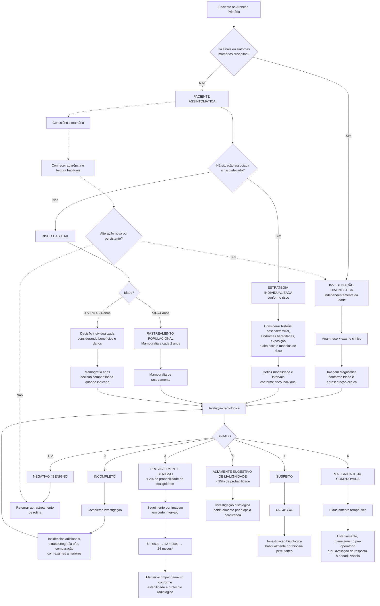

# Rastreamento e Diagnóstico Precoce do Câncer na Atenção Primária: Mama

​	O rastreamento do câncer de mama é uma medida de saúde pública que se justifica por ser o mais incidente na população feminina mundial e brasileira, depois do câncer de pele não melanoma. Atualmente o controle do câncer de mama é uma das prioridades da agenda de saúde do país. Desde a década de 1980, o controle do câncer de mama consolidou-se no SUS por meio de sucessivas políticas públicas, sistemas de informação e planos estratégicos estruturados pelo Ministério da Saúde e pelo INCA. Ao longo das décadas, essas ações focaram na constante atualização técnica das diretrizes de rastreamento e diagnóstico precoce para estruturar a rede assistencial, ampliar o acesso ao tratamento e reduzir a mortalidade feminina no país.

​	O controle do câncer de mama na Atenção Primária apoia-se em duas estratégias estruturais distintas, cujas indicações e fluxos de atendimento não devem ser confundidos na prática clínica: o rastreamento em pacientes assintomáticas e o diagnóstico precoce em pacientes com queixas clínicas.

​	O rastreamento consiste na aplicação de exames de rotina em mulheres assintomáticas. Para ser efetivo como política pública, deve ser direcionado estritamente à faixa etária e à periodicidade nas quais há evidência conclusiva de redução de mortalidade e um balanço favorável entre benefícios e danos. O rastreamento bienal em mulheres de 50 a 74 anos oferece o benefício de identificar a doença em estágios iniciais, permitindo tratamentos mais eficazes e com menor morbidade. Em contrapartida, impõe riscos inerentes, como resultados falso-positivos (que geram excesso de exames complementares e ansiedade), falso-negativos (falsa tranquilidade), sobrediagnóstico e sobretratamento (identificação de tumores indolentes), além da exposição repetida à radiação ionizante.

​	Os sistemas de saúde podem conduzir o rastreamento de duas formas:

- **Oportunístico:** O exame é ofertado apenas àquelas que, por algum motivo, procuram a unidade de saúde.
- **Organizado:** A população-alvo é formalmente convidada para os exames periódicos, com garantia de controle de qualidade, monitoramento de resultados e seguimento oportuno em todas as etapas. A experiência internacional comprova que o modelo organizado apresenta impacto muito superior na redução da mortalidade e melhor custo-efetividade.

​	A estratégia de diagnóstico precoce é acionada assim que uma paciente (ou paciente do sexo masculino) identifica uma alteração suspeita e busca a unidade de saúde. Diferente do rastreamento, o diagnóstico precoce independe de idade ou faixa etária alvo. A premissa fundamental para o generalista é que **pacientes com sinais ou sintomas suspeitos devem ser encaminhadas para investigação diagnóstica, independentemente da idade ou de estarem dentro da faixa etária de rastreamento**. O sistema de saúde deve estar estruturado para acolher essa demanda espontânea e garantir a realização de exames diagnósticos em tempo oportuno. Esta estratégia é especialmente crítica em regiões e contextos onde os tumores tendem a ser diagnosticados em estágios clinicamente avançados.

## Mapa de Decisão

## Mapa de decisão

## População-Alvo e Perspectiva Brasileira

​	Em setembro de 2025, o INCA atualizou suas recomendações para a realização do rastreamento pelo SUS, sendo o **critério de risco habitual mulheres entre 50 e 74 anos com periodicidade bienal**. A justificativa do Ministério da Saúde é que essa é a faixa etária na qual existe a maior comprovação científica de redução da mortalidade com um balanço favorável entre benefícios e danos. Essa recomendação também inclui homens trans e pessoas não-binárias assignadas no feminino ao nascer, caso mantenham as mamas.

​	Para a prática na Atenção Primária, é fundamental diferenciar **rastreamento** de **diagnóstico precoce**. O rastreamento populacional é realizado em pacientes assintomáticas. Em contrapartida, pacientes com sinais ou sintomas suspeitos (como um nódulo palpável) devem ser submetidas à investigação diagnóstica imediatamente, independentemente da idade. Uma paciente de 40 anos com alteração mamária, por exemplo, jamais deve ser excluída da investigação por estar fora da faixa etária do rastreio de rotina.

​	A recomendação brasileira não impede que mulheres assintomáticas fora dessa faixa (40 a 49 anos ou com mais de 74 anos) realizem a mamografia no SUS. Contudo, o acesso deve ser mediado por uma decisão compartilhada, na qual o profissional de saúde orienta sobre os riscos inerentes ao rastreamento precoce ou tardio, que incluem:

- **Sobrediagnóstico e Sobretratamento:** Identificação de tumores indolentes que nunca causariam sintomas ou ameaçariam a vida da paciente, mas que acabam gerando tratamentos desnecessários.
- **Falso-positivos e Exames Invasivos:** Achados inconclusivos que geram ansiedade e exigem exames adicionais (ultrassonografia, ressonância) ou biópsias para descarte de malignidade.

Mulheres com risco elevado não devem necessariamente seguir a mesma estratégia do rastreamento populacional. A avaliação deve considerar história pessoal e familiar, exposições de alto risco, síndromes hereditárias e, quando apropriado, modelos de estimativa de risco. Mutações germinativas em BRCA1 e, particularmente, BRCA2 estão associadas a aumento do risco de câncer de mama em mulheres e homens.

**Critérios de alto risco (indicação de acompanhamento precoce ou em homens):**

- **Irradiação torácica prévia:** Histórico de radioterapia supradiafragmática antes dos 36 anos de idade (frequentemente utilizada no tratamento de linfoma de Hodgkin).
- **Mutações nos genes BRCA1 e BRCA2:** Associadas à síndrome de câncer de mama e ovário hereditários, sendo também o principal fator de risco genético para o câncer de mama masculino.
- **Síndromes genéticas específicas:** Diagnóstico pessoal ou familiar de Síndrome de Li-Fraumeni (mutação no gene TP53) ou Síndrome de Cowden (mutação no gene PTEN).
- **Outras mutações de risco:** Identificação laboratorial de alterações nos genes PALB2, CHEK2, BARD1, ATM, RAD51C e RAD51D.

**Divergências nas Diretrizes Internacionais** A recomendação do INCA se alinha ao Código Latino-Americano e Caribenho contra o Câncer, mas o debate global sobre o momento de iniciar, a periodicidade e a interrupção do rastreio é amplo. A divergência não está na eficácia da mamografia, mas no peso que cada instituição atribui aos danos (como o sobrediagnóstico) frente aos benefícios (redução de mortalidade).

- **American College of Physicians (ACP):** Adota uma postura mais conservadora, semelhante ao SUS. Recomenda o rastreamento bienal entre 50 e 74 anos para risco habitual. Para a faixa de 40-49 anos, orienta a individualização baseada nos potenciais benefícios e danos.
- **American College of Radiology (ACR) e National Comprehensive Cancer Network (NCCN):** Adotam uma estratégia mais intensiva. Recomendam o início do rastreamento aos 40 anos e com periodicidade anual. O ACR argumenta que o risco de câncer não é desprezível antes dos 50 anos e alerta para diferenças raciais e étnicas, apontando que uma parcela substancial dos cânceres em mulheres negras, hispânicas e asiáticas ocorre na faixa dos 40 anos.
- **Idade de Interrupção:** Enquanto diretrizes focadas em saúde pública (como as do SUS e ACP) tendem a limitar o rastreamento aos 74 anos devido ao aumento exponencial do risco de sobrediagnóstico em idades avançadas, o ACR não estabelece uma idade máxima universal. Argumenta-se que a continuidade deve ser baseada na expectativa de vida, estado geral de saúde e tolerância a um eventual tratamento, e não apenas na idade cronológica.

## Consciência mamária: por que não recomendamos o autoexame sistemático

Historicamente, o sistema de saúde e as campanhas de conscientização promoveram o autoexame das mamas (BSE – *Breast Self-Examination*) como uma técnica rígida. O BSE exigia que a mulher realizasse uma palpação sistemática, estruturada e com periodicidade fixa para rastrear o câncer. A evidência científica acumulada, entretanto, modificou essa conduta. Revisões sistemáticas rigorosas demonstraram que o BSE não apresenta benefício na redução da mortalidade e, pior, atua frequentemente como gatilho para ansiedade exacerbada ("medo do câncer") e intervenções desnecessárias.

**O Paradigma da Consciência Mamária**

Para substituir a rigidez do BSE, consolidou-se o conceito de Consciência Mamária (*Breast Awareness* - BA). Essa abordagem não exige técnica padronizada, calendário ou palpação metódica. Em vez de transformar a paciente em uma "examinadora de si mesma", o objetivo é cultivar uma **atenção sensata** (*sensible alertness*).

O médico deve orientar a paciente a observar e palpar as mamas sempre que se sentir confortável no cotidiano — seja durante o banho, na troca de roupa ou em momentos de relaxamento. O princípio é que a paciente se familiarize com o aspecto, o volume e a textura habituais do próprio corpo ao longo da vida, desenvolvendo confiança para notar quando algo foge ao seu padrão normal. A grande maioria das mulheres que identificam o próprio câncer o fazem casualmente por meio dessa percepção corporal, e não através de exames estruturados.

**Sinais de Alerta para Orientação em Consulta** 

O generalista deve educar os pacientes (incluindo homens, que também devem estar atentos às próprias mamas) a buscar avaliação médica imediata caso notem qualquer uma das seguintes alterações:

- **Morfologia:** Mudanças no tamanho ou formato da mama, incluindo aumento unilateral ou alteração de posição.
- **Pele:** Retrações, aspecto de casca de laranja (*dimpling*) ou erupções cutâneas na aréola/mamilo ou ao redor.
- **Mamilo:** Inversão recente, mudança de formato ou secreção mamilar espontânea.
- **Nódulos:** Aparecimento de nódulo palpável ou espessamento tecidual diferente do restante da mama.
- **Sintomas Regionais:** Dor localizada persistente na mama ou na axila, além de edema ou aumento de volume (linfonodomegalias) nas regiões axilar ou supraclavicular.

## Prevenção Primária: Modificação de Fatores de Risco e o Papel do Estilo de Vida

A prevenção do câncer de mama concentra-se fundamentalmente na redução da exposição aos fatores de risco modificáveis e no fortalecimento dos fatores de proteção. Enquanto a predisposição genética (como mutações hereditárias, presentes em cerca de 5% a 10% dos casos) e fatores ligados ao ciclo reprodutivo não podem ser alterados, grande parte do risco populacional advém do estilo de vida. O excesso de gordura corporal, a inatividade física, o consumo de álcool e a terapia de reposição hormonal são fatores passíveis de intervenção clínica.

**O Papel da Nutrição e da Atividade Física** 

Níveis inadequados de nutrição e atividade física alteram a homeostase do organismo e criam um ambiente metabólico que favorece o desenvolvimento neoplásico. A prevenção primária na Atenção Primária deve estimular ativamente:

- **Manutenção do Peso Adequado:** A obesidade gera anormalidades metabólicas e endócrinas, além de promover um estado inflamatório crônico. Esses fatores estimulam o crescimento celular anormal e exercem efeitos antiapoptóticos (impedem que as células danificadas se autodestruam).
- **Atividade Física Regular:** Essencial para promover o equilíbrio dos sistemas imunológico e hormonal, reduzindo a suscetibilidade às mutações celulares.
- **Alimentação Saudável e Redução do Álcool:** Nutrientes influenciam os mecanismos de reparo do DNA e a metabolização de carcinógenos. O álcool, por sua vez, aumenta a produção de metabólitos genotóxicos e carcinogênicos.
- **Amamentação:** O aleitamento materno atua como um fator protetor e deve ser incentivado pelo maior tempo possível.
- **Controle do Tabagismo:** A cessação do fumo e a prevenção contra o tabagismo passivo reduzem a exposição a carcinógenos químicos que danificam o DNA.

## Densidade Mamária

​	A densidade mamária representa um duplo desafio na prática clínica, atuando simultaneamente como um fator de risco independente para o desenvolvimento do câncer de mama e como uma importante causa de redução da sensibilidade da mamografia, visto que o tecido fibroglandular denso pode mascarar tumores e reduzir a acurácia do exame para cerca de 61% a 68% em mamas extremamente densas (BI-RADS D). Diante dessa limitação, cujo próprio sistema de classificação BI-RADS apresenta reprodutibilidade limitada, com frequentes variações de laudo entre radiologistas, o uso de rastreamento suplementar tem sido amplamente debatido na Atenção Primária. Embora a ultrassonografia (manual ou automatizada) e a ressonância magnética (RM) aumentem a detecção de cânceres predominantemente invasivos ocultos na mamografia, esses métodos elevam de forma expressiva as taxas de resultados falso-positivos, *recalls* (convocações) e biópsias desnecessárias, sem que haja evidências sólidas de redução na mortalidade global ou clareza sobre o grau de sobrediagnóstico associado. A tomossíntese mamária surge como uma alternativa que melhora a detecção e, diferentemente do ultrassom, tende a reduzir os *recalls*, embora implique maior exposição à radiação. Para o subgrupo específico de pacientes com mamas *extremamente* densas, diretrizes internacionais mais recentes, como as da Sociedade Europeia de Imagem Mamária (EUSOBI), orientam informar a paciente sobre sua condição e considerar a RM com contraste a cada dois a quatro anos (especialmente entre 50 e 70 anos), dado o seu impacto comprovado na redução drástica de cânceres intervalares. 

​	Contudo, para mamas heterogeneamente densas a evidência permanece insuficiente, cabendo ao médico generalista conduzir sempre uma tomada de decisão compartilhada, discutindo abertamente com a paciente o delicado balanço entre a possibilidade de um diagnóstico antecipado e os potenciais danos do rastreio intensivo, como a ansiedade, a necessidade de uso de contraste e a cascata de exames e procedimentos invasivos adicionais.

## Interpretação de Mamografia

**Passo 1: Valide o Contexto do Exame** Antes de ler os achados, verifique a técnica e o histórico.

- **A técnica:** Foi mamografia digital (DM) ou tomossíntese (DBT)? A DBT reduz o efeito da sobreposição de tecidos e pode melhorar a detecção de determinados achados, especialmente em mamas densas.
- **O histórico:** Houve comparação com exames prévios? A estabilidade de uma lesão ao longo dos anos é um forte indício de benignidade.
- **A localização:** O radiologista usa o sistema de quadrantes, horas do relógio e distância do mamilo. Se você palpou um nódulo às 12h na mama direita, garanta que o laudo está descrevendo exatamente essa topografia.

**Passo 2: Reconheça o Terreno (Densidade Mamária)** A densidade dita o quanto você pode confiar em um laudo negativo e sinaliza o risco intrínseco da paciente.

- **A (Adiposa) e B (Esparsa):** A mamografia tem excelente sensibilidade. Um exame normal é muito confiável.
- **C (Heterogeneamente Densa):** Pequenas massas podem passar despercebidas.
- **D (Extremamente Densa):** A sensibilidade da mamografia despenca (61-68%) e o risco de câncer é maior. Considere rastreio suplementar se houver outros fatores de risco ou siga protocolos específicos (como RM em pacientes de alto risco).

**Passo 3: Decodifique as Massas** Se o laudo descreve uma massa, aplique a regra mental: **Forma + Margem + Densidade**.

- **Tranquilize a paciente se:** A forma for oval ou redonda, a margem for circunscrita e a densidade contiver gordura.
- **Ligue o alerta se:** A forma for *lobulada* (novo descritor do v2025, exige atenção) ou irregular.
- **Encaminhe para biópsia se:** A margem for espiculada, indistinta, ou a massa tiver alta densidade.

**Passo 4: Analise as Calcificações** Muitas calcificações são apenas envelhecimento natural do tecido. Avalie pela **Morfologia + Distribuição**.

- **São benignas:** Cutâneas, vasculares (trajetos paralelos de artérias), *coarse* (grosseiras), redondas e *milk-of-calcium*.
- **São suspeitas (Morfologia):** Amorfas, heterogêneas grosseiras, pleomórficas finas e lineares finas/ramificadas (*fine linear/branching*).
- **São muito suspeitas (Distribuição):** A distribuição *segmentar* (em forma de triângulo apontando para o mamilo) ou *linear* (seguindo o trajeto de um ducto) é altamente sugestiva de carcinoma ductal.

**Passo 5: Investigue Assimetrias e Distorções** Esses são os achados mais sutis e traiçoeiros do exame.

- **Assimetria focal:** É vista em duas projeções da mama. Se for persistente e não explicada por sobreposição de tecido normal (a tomossíntese ajuda muito aqui), precisará de investigação adicional (ultrassom).
- **Distorção arquitetural:** O parênquima está repuxado ou com linhas finas convergentes, sem uma massa central. Se a paciente não tem histórico de cirurgia ou trauma recente no local, esse achado é biópsia na certa (suspeita de carcinoma ou cicatriz radiada).

**Passo 6: Cheque os "Acessórios" (Linfonodos, Pele e Ductos)**

- **Linfonodos:** O normal é ter o formato de rim (reniforme) com o centro "limpo" (hilo adiposo). Se o laudo descreve perda do hilo adiposo, formato arredondado ou córtex espessado, há suspeita de metástase axilar.
- **Pele e Mamilo:** Espessamento cutâneo >2 mm novo ou retração mamilar unilateral e irreversível são sinais vermelhos (podem indicar carcinoma inflamatório ou infiltração).
- **Ductos:** Ductos múltiplos dilatados costumam ser benignos (gestação, lactação). No v2025, um ducto dilatado solitário, se totalmente isolado e sem sintomas, também pode ser classificado como benigno.

## Classficiação BI-RADS e Conduta Clínica

​	A categoria final do sistema BI-RADS é o desfecho de toda a análise mamográfica e dita de forma padronizada qual deve ser o próximo passo do médico generalista. Compreender essa classificação é fundamental, pois ela direciona a conduta clínica com segurança, evitando tanto a omissão diante de achados suspeitos quanto intervenções excessivas em lesões inofensivas.

​	Quando o laudo aponta a categoria BI-RADS 0, isso significa estritamente que o exame está incompleto. O médico jamais deve liberar a paciente com esse resultado ou assumir uma conduta de observação clínica. A ação obrigatória do generalista é solicitar uma avaliação diagnóstica complementar — seja uma ultrassonografia mamária, incidências mamográficas adicionais (como compressão focal ou magnificação) ou o resgate de exames antigos para avaliar a estabilidade temporal da lesão.

​	Para os resultados BI-RADS 1 (exame totalmente negativo, sem achados) e BI-RADS 2 (presença de achados inequivocamente benignos, como fibroadenomas calcificados, cistos simples ou clipes cirúrgicos), a conduta é idêntica e direta. O profissional deve tranquilizar a paciente e orientar a manutenção do rastreamento de rotina padrão de acordo com sua faixa etária, sem necessidade de exames extras.

​	A categoria BI-RADS 3 exige atenção especial. Ela indica achados "provavelmente benignos", com risco de malignidade inferior a 2%. Nesses casos, a paciente não é submetida a biópsia de imediato, mas também não volta ao rastreamento de rotina. A conduta clínica é o controle radiológico precoce, que consiste em repetir o exame de imagem ipsilateral geralmente no intervalo de 6, 12 e 24 meses para atestar a estabilidade da lesão. Vale destacar que essa classificação só pode ser atribuída após uma investigação por imagem completa, não sendo adequada para mamografias de rastreamento iniciais que ainda necessitam de incidências extras.

​	As categorias BI-RADS 4 e BI-RADS 5 são os gatilhos para intervenção invasiva e exigem o encaminhamento célere da paciente para investigação histológica (biópsia). A categoria 4 abrange achados suspeitos com um espectro amplo de risco, sendo subdividida em baixa (4A), moderada (4B) e alta suspeição (4C). Já a categoria 5 agrupa lesões com mais de 95% de probabilidade de corresponderem ao câncer, como massas de margens espiculadas e densas. Em ambos os cenários, a biópsia percutânea é obrigatória.

​	Por fim, a categoria BI-RADS 6 é restrita ao cenário de malignidade já comprovada por biópsia prévia. Ela é utilizada pelo radiologista durante o estadiamento pré-operatório, no planejamento cirúrgico ou na avaliação da resposta do tumor ao tratamento de quimioterapia neoadjuvante, antes da terapia definitiva.

---

## Referências

1. American College of Radiology. BI-RADS: Breast Imaging Reporting and Data System [Internet]. American College of Radiology; 2025. Available from: https://www.acr.org/Clinical-Resources/Clinical-Tools-and-Reference/Reporting-and-Data-Systems/BI-RADS
2. Thornton H, Pillarisetti RR. ‘Breast awareness’ and ‘breast self-examination’ are not the same. What do these terms mean? Why are they confused? What can we do? European Journal of Cancer. 2008 Oct;44(15):2118–21. doi:10.1016/j.ejca.2008.08.015
3. Mann RM, Athanasiou A, Baltzer PAT, Camps-Herrero J, Clauser P, Fallenberg EM, et al. Breast cancer screening in women with extremely dense breasts recommendations of the European Society of Breast Imaging (EUSOBI). Eur Radiol. 2022 Jun;32(6):4036–45. doi:10.1007/s00330-022-08617-6
4. US Preventive Services Task Force. Breast Cancer: Screening [Internet]. US Preventive Services Task Force; 2024. Available from: https://www.uspreventiveservicestaskforce.org/uspstf/recommendation/breast-cancer-screening
5. Instituto Nacional de Câncer. Controle do câncer de mama: detecção precoce [Internet]. Instituto Nacional de Câncer; 2025. Available from: https://www.gov.br/inca/pt-br/assuntos/gestor-e-profissional-de-saude/controle-do-cancer-de-mama/acoes/deteccao-precoce
6. Instituto Nacional de Câncer. Instituto Nacional de Câncer - INCA [Internet]. 2024 [cited 2026 Sep 26]. Controle do Cãncer de Mama: Prevenção. Available from: https://www.gov.br/inca/pt-br/assuntos/gestor-e-profissional-de-saude/controle-do-cancer-de-mama/acoes/prevencao
7. Instituto Nacional de Câncer. Instituto Nacional de Câncer - INCA [Internet]. 2024 [cited 2026 Sep 26]. Controle do Câncer de Mama: Promoção da saúde. Available from: https://www.gov.br/inca/pt-br/assuntos/gestor-e-profissional-de-saude/controle-do-cancer-de-mama/acoes/promocao-da-saude
8. Instituto Nacional de Câncer, American Institute for Cancer Research, World Cancer Research Fund. INCA - Instituto Nacional de Câncer [Internet]. 2020 [cited 2026 Sep 26]. Dieta, nutrição, atividade física e câncer: uma perspectiva global - um resumo do terceiro relatório de especialistas com uma perspectiva brasileira. Available from: https://www.inca.gov.br/publicacoes/relatorios/dieta-nutricao-atividade-fisica-e-cancer-uma-perspectiva-global-um-resumo-do
9. National Comprehensive Cancer Network. NCCN Clinical Practice Guidelines in Oncology: Breast Cancer [Internet]. 2026 Jul. Available from: https://www.nccn.org/guidelines/guidelines-detail?category=1&id=1419
10. National Comprehensive Cancer Network. NCCN Clinical Practice Guidelines in Oncology: Breast Cancer Screening and Diagnosis [Internet]. National Comprehensive Cancer Network; 2026 May. Report 1.2026. Available from: https://guidelines.nccn.org/guidelines/breast_screening?_session=C5FA6A96B303148EDBA06E97ABA32950
11. American College of Radiology and Society of Breast Imaging Statement. American College of Radiology [Internet]. 2026 [cited 2026 Sep 15]. New ACP Breast Cancer Screening Guidelines May Cost Lives. Available from: https://www.acr.org/News-and-Publications/Media-Center/2026/new-breast-cancer-screening-guidelines-may-cost-lives
12. Instituto Nacional de Câncer. Posicionamento oficial do Instituto Nacional de Câncer (INCA) sobre faixa etária recomendada para mamografia de rastreio [Internet]. Instituto Nacional de Câncer; 2025. Available from: https://www.gov.br/inca/pt-br/canais-de-atendimento/imprensa/releases/2025/posicionamento-oficial-do-instituto-nacional-de-cancer-inca-sobre-faixa-etaria-recomendada-para-mamografia-de-rastreio
13. Qaseem A, Harrod CS, Balk EM, Etxeandia-Ikobaltzeta I, Crandall CJ, Clinical Guidelines Committee of the American College of Physicians, et al. Screening for Breast Cancer in Asymptomatic, Average-Risk Adult Females: A Guidance Statement From the American College of Physicians (Version 2). Ann Intern Med. 2026 Jun;179(6):842–56. doi:10.7326/ANNALS-25-05116
14. Melnikow J, Fenton JJ, Whitlock EP, Miglioretti DL, Weyrich MS, Thompson JH, et al. Supplemental Screening for Breast Cancer in Women With Dense Breasts: A Systematic Review for the U.S. Preventive Service Task Force [Internet]. Rockville (MD): Agency for Healthcare Research and Quality (US); 2016 [cited 2026 Sep 15]. (U.S. Preventive Services Task Force Evidence Syntheses, formerly Systematic Evidence Reviews). Available from: http://www.ncbi.nlm.nih.gov/books/NBK343793/ PubMed PMID: 26866210.
15. Schijf L, Smithuis R. Radiology Assistant [Internet]. 2026 [cited 2026 Sep 15]. The Radiology Assistant: BI-RADS v2025 Manual - Mammography Updated Version. Available from: https://radiologyassistant.nl/breast/bi-rads/bi-rads-for-mammography-and-ultrasound-2013-1-1
